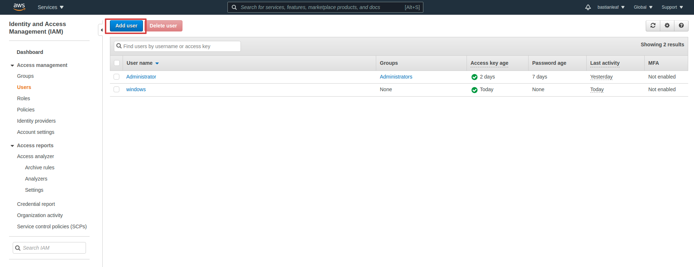
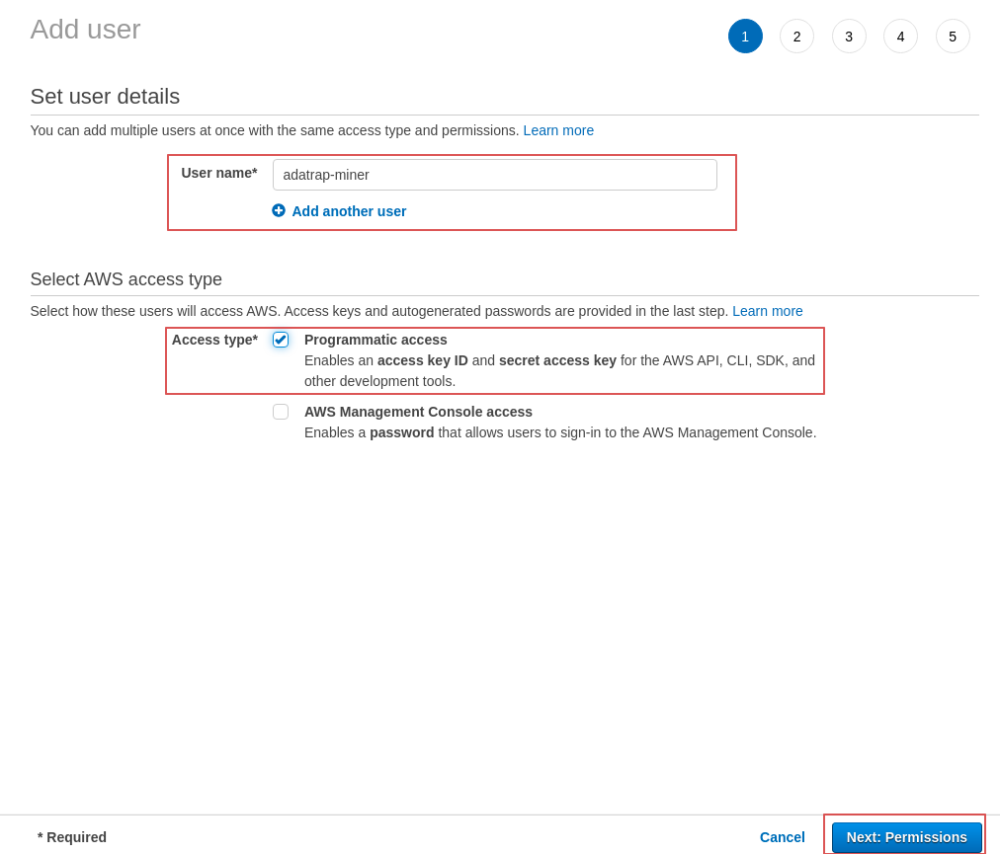
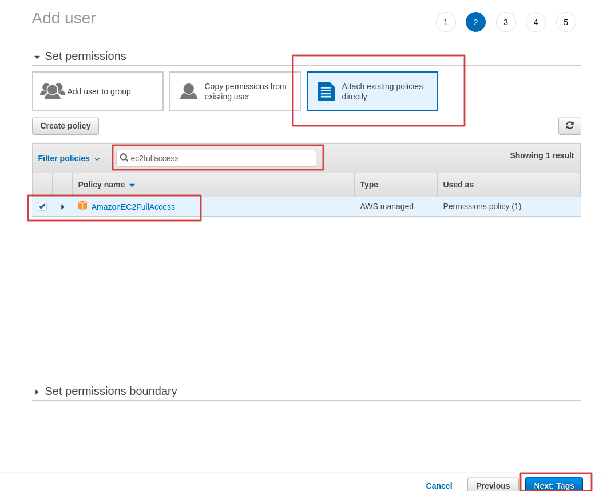
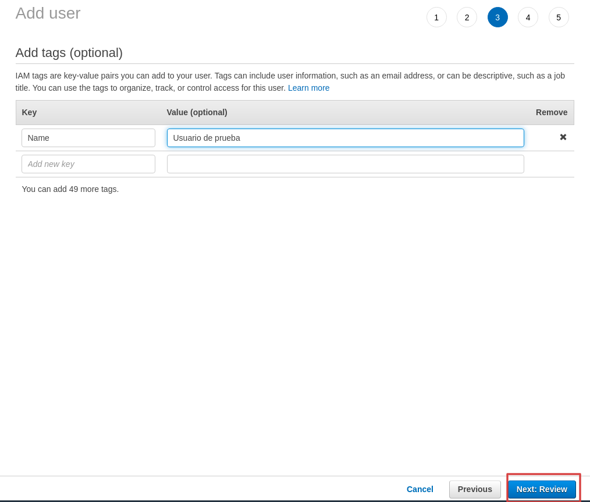
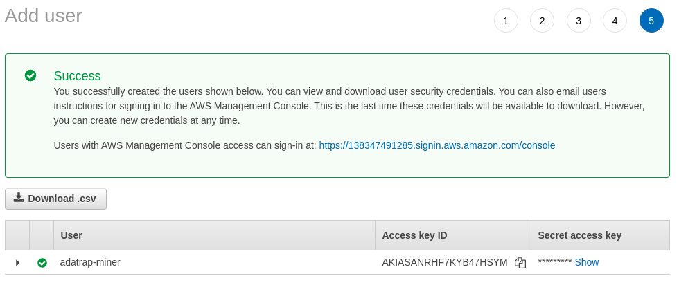
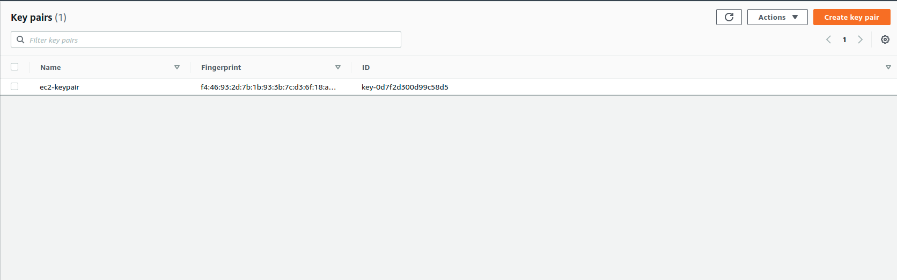
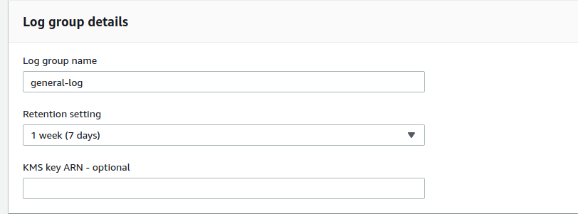
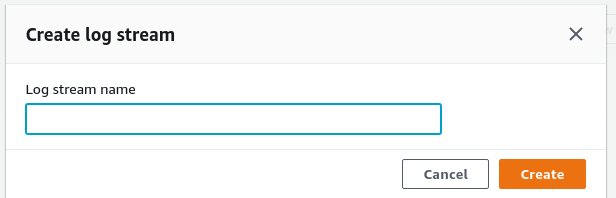

# ADATRAP Miner

Programa que se encarga de descargar y procesar datos de viajes y transacciones Transantiago.

## Instalación del proyecto

El proyecto se encuentra desarrollado en Python 3.8 y utiliza los siguientes servicios de Amazon Web Services para su
funcionamiento:
[EC2](https://aws.amazon.com/ec2/), [S3](https://aws.amazon.com/s3/) y [Cloudwatch](https://aws.amazon.com/cloudwatch/).

### Requerimientos

#### Creación de entorno virtual

Para no tener conflictos de dependencias se recomienda hacer uso de
un [entorno virtual](https://docs.python.org/3/tutorial/venv.html), este puede ser creado usando la
librería [virtualenv](https://virtualenv.pypa.io/en/latest/).

```
    # instalar librería virtualenv
    pip install virtualenv

    # crear entorno virtual
    virtualenv venv

    # activar entorno virtual
    source venv/bin/activate
```

#### Instalación de dependencias Python

Las librerías necesarias para ejecutar el proyecto están definidas en el archivo `requirements.txt`
ubicado en la raíz del proyecto y se pueden instalar rápidamente con el comando:

    pip install -r requirements.txt

Además para agregar el comando `adatrap_miner` a las variables de ambiente se debe ejecutar:

    pip install -e .

### Usuario AWS

Para el funcionamiento del script se requieren las credenciales de un usuario AWS con permisos **AmazonEC2FullAccess**.

#### 1) Crear usuario

Para crear un usuario nuevo se debe acceder a la plataforma [IAM](https://console.aws.amazon.com/iam/home#/home) de AWS
en la sección [usuarios](https://console.aws.amazon.com/iam/home#/users) y seleccionar la opción **Add User**:



#### 2) Nombrar usuario

Posteriormente se debe escribir un nombre de usuario en **User name**, marcar la casilla **Programmatic access** y
avanzar al siguiente paso haciendo click en el botón **Next: permissions**.



#### 3) Permisos de Usuario

En esta sección se darán los permisos de EC2, S3 y Cloudwatch al usuario. Para esto debe seleccionar la opción **Attach
existing policies directly**. Posteriormente en el cuadro de búsqueda buscar y seleccionar las siguientes palabras: **AmazonEC2FullAccess**, **AmazonS3FullAccess**, **CloudWatchAgentAdminPolicy**, **CloudWatchAgentServerPolicy**
y **AmazonSSMFullAccess**

Finalmente se puede ir al siguiente paso **Next: Tags**.



#### 4) Tags (Opcional)

Opcionalmente se pueden añadir etiquetas para identificar o almacenar datos referentes al usuario. Ir al paso siguiente **Next Review**.



#### 5) Review

En esta sección se debe revisar que todos los datos estén correctos y avanzar al siguiente


#### 6) Guardar credenciales

El usuario ha sido creado exitosamente, por lo que es importante guardar sus credenciales en la sección **download.csv**
. Ambas credenciales **Access key ID** y **Secret access key** serán utilizadas para la configuración del proyecto.


### .env

Se debe crear un archivo .env en la raíz del proyecto el cual incluirá las credenciales y otra información en el
siguiente formato:

```
# Id de acceso creado en el paso anterior.
AWS_ACCESS_KEY_ID= 

# Clave de acceso creado en el paso anterior
AWS_SECRET_ACCESS_KEY= 

# Región donde se ubicará la instancia EC2 (Ejemplo: us-east-1)
REGION_NAME= 

# Id de la imagen a utilizar en la instancia EC2
AMI_ID= 

# Nombre de la máquina ec2 a utilizar (ej: t2.micro)
INSTANCE_TYPE= 

# Par de claves para acceso ec2 (Si se desea crear una nueva key pair dejar un nombre por defecto.)
KEY_PAIR= 

# Nombre de log de grupo Cloudwatch
LOG_GROUP= 

# Id para el log general
GENERAL_LOG_STREAM= 

# Bucket donde se encuentra ejecutable ADATRAP
EXECUTABLES_BUCKET= 

# Bucket de gps
GPS_BUCKET_NAME=

# Bucket de po
OP_PROGRAM_BUCKET_NAME=

# Bucket de archivo 196
FILE_196_BUCKET_NAME=

# Bucket de transacciones
TRANSACTION_BUCKET_NAME=

# Bucket S3 donde se almacenan los resultados de ADATRAP
OUTPUT_DATA_BUCKET_NAME=

# Bucket S3 donde se almacena el detalle de los servicios
SERVICE_DETAIL_BUCKET_NAME=
```

Los valores de cada una de las variables será explicado en los pasos siguientes.

### Creación de Key Pair

Para la creación de instancias EC2 y el manejo de estas se requiere tener una **keypar** para poder acceder a las
instancias creadas en python. Para esto el programa tiene un comando que permite la creación de un keypar dado los datos
de usuario en el archivo .env (variables **AWS_ACCESS_KEY_ID** y **AWS_SECRET_ACCESS_KEY**).

Este comando crea una keypair con el nombre dado como argumento o **ec2-keypair** por defecto, la cual se registra en
AWS y se almacena localmente en la raíz del proyecto.

Para crear un keypar se debe ejecutar:

    adatrap_miner create-key-pair [key-pair-name]

Si todo resulta correcto se obtendrá el siguiente mensaje:

    INFO:__main__:¡Keypair creado exitosamente! El archivo ec2-keypair.pem se encuentra en la raíz del proyecto.

En caso de que la keypar exista el programa arrojará un error:

    ERROR:__main__:El keypair 'ec2-keypair' ya existe

Ya habiendo sido creada la keypair, esta se encontrará disponible en el panel de administración EC2 de AWS:



Después de crear la key-pair es importante agregar su nombre en la variable *KEY_PAIR* archivo *.env*

## Creación de logs en Cloudwatch

Para el funcionamiento de adatrap-Miner se requiere la creación de un log group de Cloudwatch y un log stream. Un log
stream es una secuencia de eventos de log que se comparten en la misma fuente, mientras que un log group es un conjunto
de log streams.

Por lo tanto adatrap-Miner utilizará el log group para crear log streams asociados a las instancias EC2 creadas. Por
otra parte utilizará el log stream creado como un log general de eventos asociados al proyecto.

### Log Group

Para crear un Log Group se debe acceder a la
plataforma [Cloudwatch](https://us-east-1.console.aws.amazon.com/cloudwatch/home?region=us-east-1#logsV2:log-groups) y
seleccionar la opción **Create log group**.

Se debe ingresar un nombre en *Log group name*. En la sección *Retention setting* se debe seleccionar la opción "1 week"
. Esto permitirá que los logs se almacenen durante una semana como máximo.



Finalmente se debe seleccionar la opción *create*

Es importante agregar el nombre del log group al parámetro *LOG_GROUP* del archivo *.env*

### Log Stream

Para agregar un log stream se debe ingresar al log group creado desde la interfaz de Cloudwatch y seleccionar la
opción *Create log stream*.



Finalmente también se debe agregar el nombre a la variable *GENERAL_LOG_STREAM* del archivo *.env*.

## Uso

Para ejecutar adatrap_miner se deben ejecutar el comando con la fecha en formato YYYY-MM-DD

    adatrap_miner create-ec2-instance 2021-04-22

## Comandos disponibles

### Detener instancia EC2

Para detener una instancia EC2 se debe ejecutar

    adatrap_miner stop-ec2-instance ID

Donde *ID* es el id de la instancia.

### Obtener logs

Para obtener los logs asociados a un log stream se debe ejecutar

    adatrap_miner get-log-stream LOGNAME DATE

Donde *LOGNAME* es el nombre del log stream y *DATE* es desde que fecha. Si se quiere almacenar en un archivo se debe
utilizar la variable -o

    adatrap_miner get-log-stream LOGNAME DATE -o OUTPUTNAME


