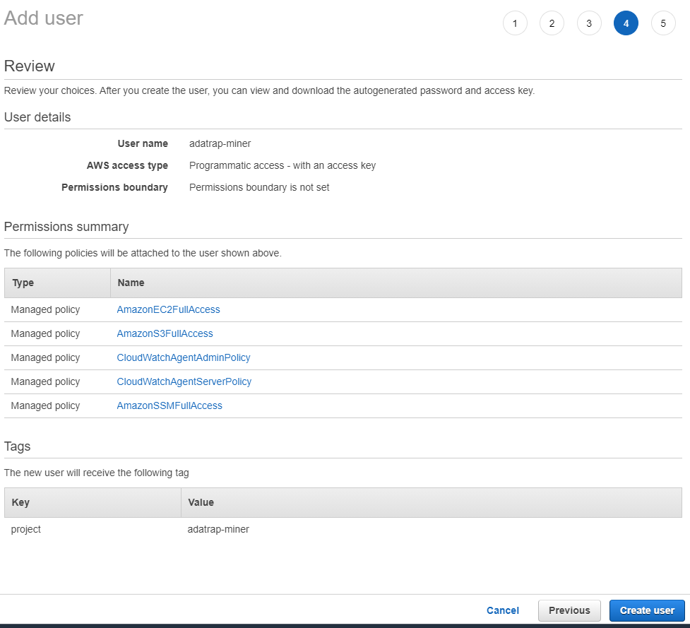

# ADATRAP Miner

Programa que se encarga de descargar y procesar datos de viajes y transacciones Transantiago.

## Instalación del proyecto

El proyecto se encuentra desarrollado en Python 3.8 y utiliza [Instancias EC2 de Amazon Web Services](
aws.amazon.com/aws/ec2) para su funcionamiento.

### Requerimientos

##### Creación de entorno virtual

Para no tener conflictos de dependencias se recomienda hacer uso de un [entorno virtual](https://docs.python.org/3/tutorial/venv.html), este puede ser creado usando la librería [virtualenv](https://virtualenv.pypa.io/en/latest/).
```
    # instalar librería virtualenv
    pip install virtualenv

    # crear entorno virtual
    virtualenv venv

    # activar entorno virtual
    source venv/bin/activate
```

##### Instalación de dependencias Python

Las librerías necesarias para ejecutar el proyecto están definidas en el archivo `requirements.txt`
ubicado en la raíz del proyecto y se pueden instalar rápidamente con el comando `pip install -r requirements.txt`.

#### Usuario AWS
Para el funcionamiento del script se requieren las credenciales de un usuario AWS con permisos **AmazonEC2FullAcces**.

##### 1) Crear usuario
Para crear un usuario nuevo se debe acceder a la plataforma [IAM](https://console.aws.amazon.com/iam/home#/home) de AWS en la sección [usuarios](https://console.aws.amazon.com/iam/home#/users) y seleccionar la opción **Add User**:


##### 2) Nombrar usuario
Posteriormente se debe escribir un nombre de usuario en **User name**, marcar la casilla **Programmatic access** y avanzar al siguiente paso haciendo click en el botón **Next: permissions**


##### 3) Permisos de Usuario
En esta sección se darán los permisos al usuario debe seleccionar la opción **Attach existing policies directly**. Posteriormente en el cuadro de búsqueda buscar **ec2fullaccess** y marcar la casilla **AmazonEC2FullAccess**

Finalmente se puede ir al siguiente paso **Next: Tags**.


##### 4) Tags (Opcional)

Opcionalmente se pueden añadir etiquetas para identificar o almacena datos referente al usuario. Ir al paso siguiente **Next Review**.


##### 5) Review
En esta sección se debe revisar que todos los datos estén correctos y avanzar al siguiente 



##### 6) Guardar credenciales

El usuario ha sido creado exitosamente, por lo que es importante guardar sus credenciales en la sección **download.csv**. Ambas credenciales **Access key ID** y **Secret access key** serán utilizadas para la configuración del proyecto.


### .env

Se debe crear un archivo .env en la raíz del proyecto el cual incluirá las credenciales y otra información en el siguiente formato:

AWS_ACCESS_KEY_ID= Id de acceso creado en el paso anterior.
AWS_SECRET_ACCESS_KEY= Clave de acceso creado en el paso anterior
REGION_NAME= Región donde se ubicará la instancia EC2 (Ejemplo: us-east-2)
AMI_ID= Id de la imagen a utilizar en la instancia EC2


#### Creacióna de Key Pair

Para la creación de instancias EC2 y el manejo de estas se requiere tener una **keypar** para poder acceder a las instancias creadas en python. Para esto el programa tiene un comando que permite la creación de un keypar dado los datos de usuario en el archivo .env.

Este comando crea una keypar llamada **ec2-keypair**, la cual se registra en AWS y se almacena localmente en la raíz del proyecto.

Para crear un keypar se debe ejecutar:

    python3 adatrap_miner.py -c

Si todo resulta correcto se obtendrá el siguiente mensaje:

    INFO:__main__:¡Keypair creado exitosamente! El archivo ec2-keypair.pem se encuentra en la raíz del proyecto.

En caso de que la keypar exista el programa arrojará un error:

    ERROR:__main__:El keypair 'ec2-keypair' ya existe


Ya habiendo sido creada la keypar, esta se encontrará disponible en el panel de administración EC2 de AWS:


    

